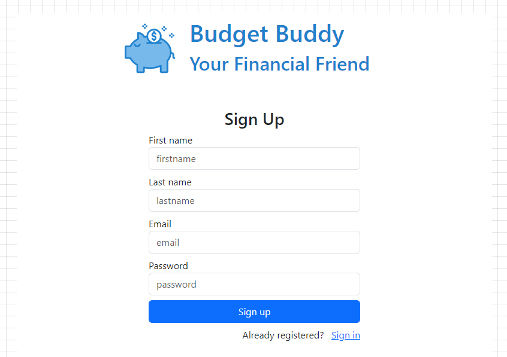
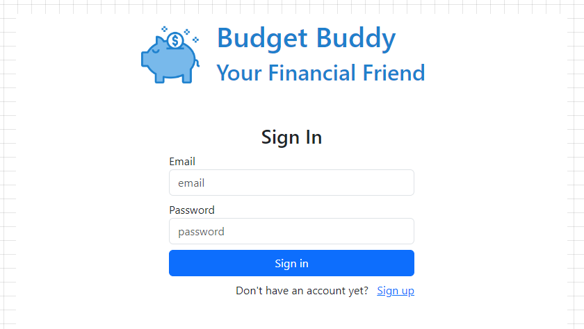
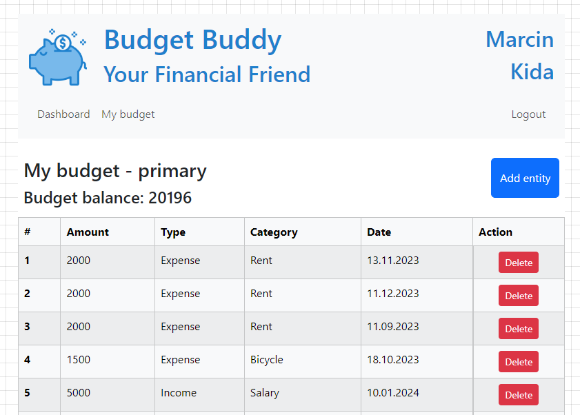
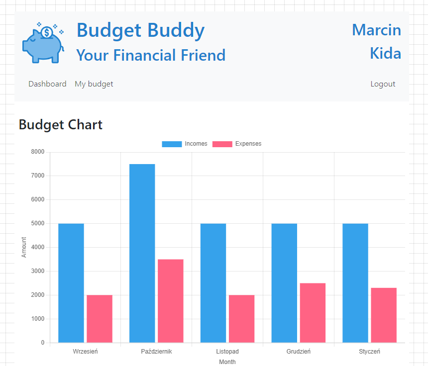
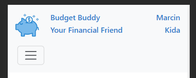
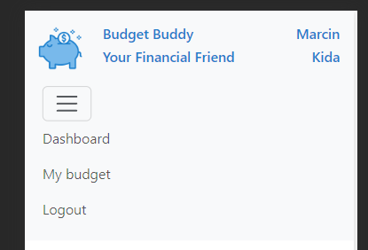
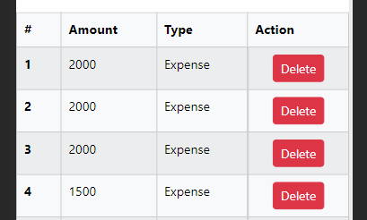

# Budget Buddy

Twój finansowy przyjaciel jest to aplikacja umożliwiająca zapisywanie bieżących dochodów i wydatków, przez co w prosty sposób mozemy kontrolować swój budżet.

## Spis treści

- [Technologie](#technologie)
- [Instrukcja uruchomienia](#instrukcja-uruchomienia)
- [Struktura projektu](#struktura-projektu)
- [Jak korzystać](#jak-korzystać)
- [Screeny z aplikacji](#screeny-z-aplikacji)

## Technologie

Główne technologie, które zostały użyte w tym projekcie to: ReactJS, Typescript i biblioteka Bootstrap.

## Instrukcja uruchomienia

0. **Uruchomienie backendu:** Instrukcję można znaleźć w repozytorium pod tym linkiem https://github.com/marcinkida97/budget-buddy-api

1. **Instalacja zależności:** Uruchom `npm install` w katalogu projektu, aby zainstalować wszystkie wymagane zależności.

2. **Uruchomienie lokalne:** Po zainstalowaniu zależności, uruchom `npm start`, aby uruchomić aplikację lokalnie.

3. **Budowanie projektu:** Aby zbudować projekt do wersji produkcyjnej, użyj komendy `npm run build`.

## Struktura projektu

Krótka informacja o strukturze katalogów i plików w projekcie.  
src/ - jest głównym folderem z gokem źrógłowym  
api/ - zawiera konfigurację axiosa
components/ - znajdują sie w nim mniejsze komponenty, które są używane w widokach
context/ - zawiera kontexty Reacta
pages/ - to w nim są główne komponenty z widokami

## Jak korzystać

1. Zarejestruj nowego użytkownika

2. Zaloguj się

3. W zakładce **My budget** dodawaj i usuwaj dochody i wydatki.
Nad tabelą widzimy nazwe budżetu.
Poniżej wyświetlony jest aktualny stan budżetu.
Po prawej stronie znajduje się niebiski przycisk Add entity, z pomocą którego można dodać wpis do tabeli.
W celu usunięcia wpisu naciśnij przycisk Delete w odpowiednim wierszu.

4. Na stronie **Dashboard** widoczny jest wykres przedstawiający wysokosć wydatków i dochodów w ostatnich 5-ciu miesiącach

5. Po wszystkim wyloguj sie klikając **Logout**

6. Dla większej wygody korzystania na urządzeniach mobilnych wprowadzone zostały 2 usprawnienia:

Menu na urządzeniu mobilnym rozwijane jest z 'burger button'  
  
  

Tabela na urządzeniu mobilnym ma zmniejszoną ilość kolumn (brak kolumny Category i Date)  
